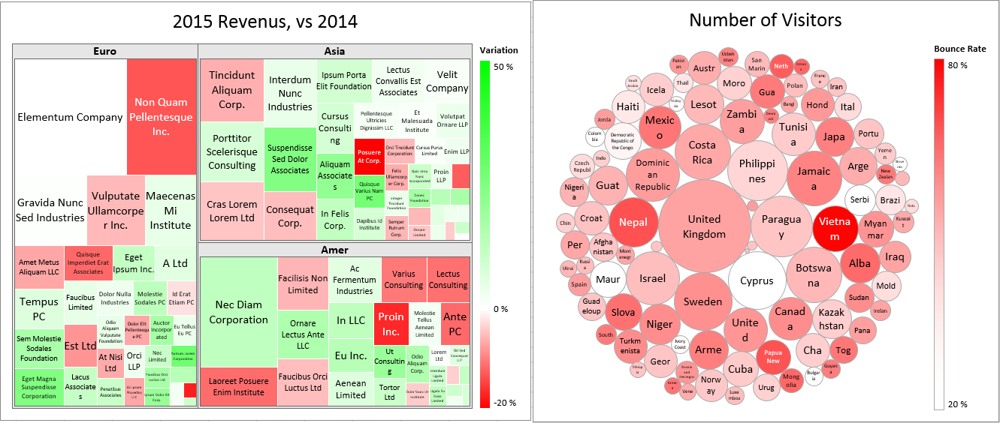
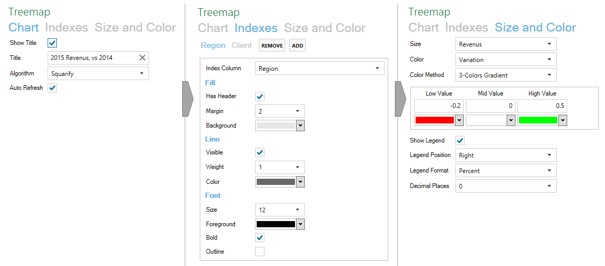
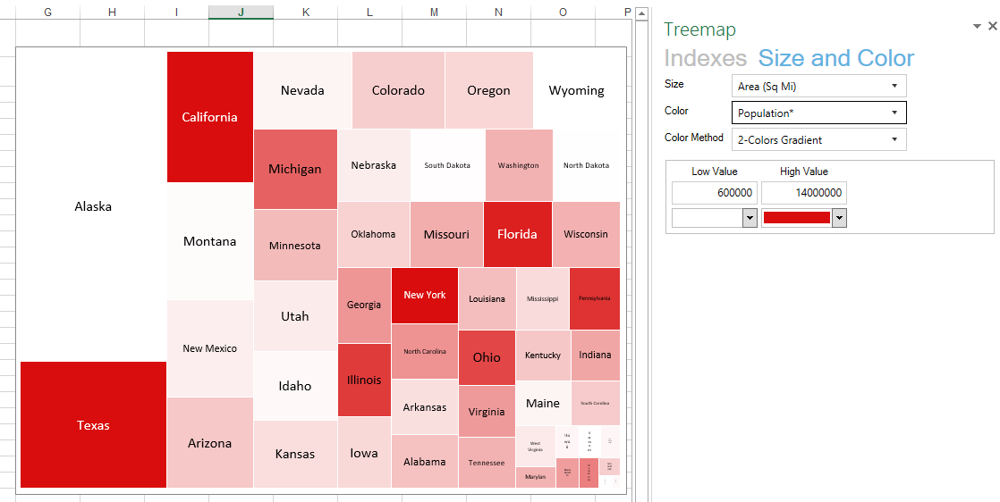

#Excel Charting Toolbox
Excel Charting Toolbox is an Excel Add-In providing advanced and intuitive charting capabilities inside Excel.
##Treemap
Create a treemap based on selected data, and interactively customize it!
- Choose which columns generate levels, sizes and colors.
- Customize chart visual by changing colors, line sizes, and more... 




* **Multi levels**: treemap can have multiple levels
* **Design**: each level has multiple options to precisely tune your treemap look
* **Colors**: treemap colors can be defined with different options: 2/3 colors gradient or palette
* Easily insert Treemap generation into your automatized reportings

```cs
//Define treemap parameters
TreemapParameters parameters = new TreemapParameters()
      .AddIndex(new TreemapIndex()
      {
          LineVisible = false,
          FontBold = false,
          FontColor = Color.Black
      })
      .WithColor(
          new ColorGradient()
              .AddStop(0, Color.White)
              .AddStop(1, Color.Red)
      );
      
//Create and print the treemap
double maxPopulation = data.Max(r => r.Population);
TreemapChart treemap = new TreemapChart<Region>(
          data,                                 //List<Region>
          r => new List<string>(r.Region),      //Indexes
          r => r.Area,                          //Size
          r => r.Population / maxPopulation,    //Color
          parameters)                           //Parameters
      .Build(0, 0, 600, 250)                    //Build treemap given a specific size and position
      .Print(sheet);                            //Print it to an Excel worksheet
```


